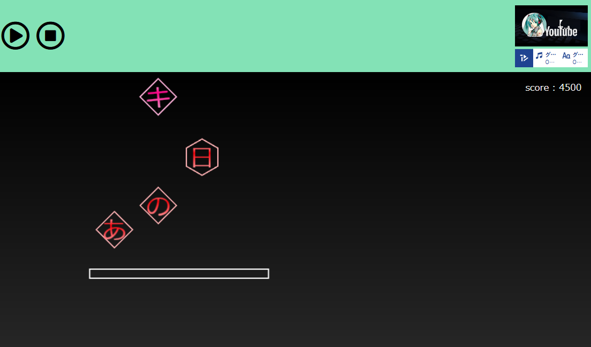

# WordCollection　　言葉集めゲーム
TextAlive App API を用いて作った、曲に合わせて上から流れてくる歌詞を画面下部にある板で受け止めるゲームです

# demo
[デモページ](https://yashinom1.github.io/WordCollection/)

[動画(youtube)](https://youtu.be/DDFEuF5H8TU)

# 遊び方
画面下部にある板はパソコンでは←→のキー押して、スマホなどの画面にタッチできるものであれば板または板の下の部分を押して左右に動かすことによって板を左右に動かすことができます。
曲に合わせて流れてくる歌詞の場所に合わせて板を動かすことによって歌詞を受けとめることができ、成功すると板から音符や星が出てきます

# アピールポイント

- 流れてくる歌詞は色をピアプロキャラクターズの6人の明るい色を黒い画面の上に表示させ、またそれを四角や円で囲むことによって、画面をカラフルで見やすくしました
- 歌詞が流れてくる位置をずらして、できるだけ歌詞が被らず見えるようにしています（少し被るところもあります）
- 下の板はスマホのタッチでも操作できるようにし、パソコンではキー操作ができるようしていて、webページの表示サイズに合わせているのでwebアプリを表示しているので、スマホでもパソコンでも遊べるようになっていると思います
- 歌詞が流れてくる場所は横に離れすぎないようにしていて、歌詞も一文字ずつ大きく表示させていて、操作も簡単であると思うので、いろんな人が遊べるようになっていると思います
